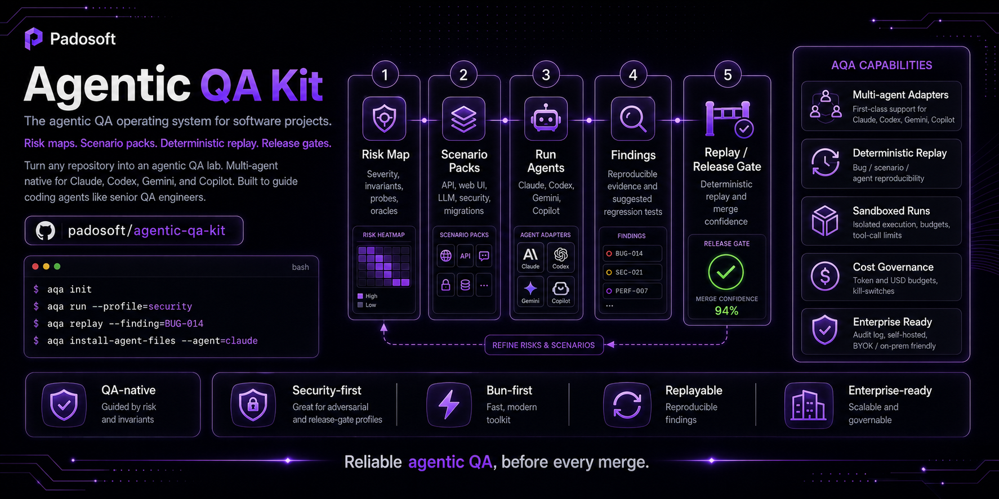

<div align="center">

# `agentic-qa-kit`

### The agentic QA operating system for software projects

**Turn any repository into an agentic QA lab. Works with Claude · Codex · Gemini · Copilot. Bun-first. Enterprise-ready.**

[](LICENSE)
[](https://bun.sh)
[](https://nodejs.org)
[](https://www.typescriptlang.org/)
[](https://github.com/padosoft/agentic-qa-kit/actions/workflows/ci.yml)
[](https://github.com/padosoft/agentic-qa-kit/releases)
[](#status)
[](#multi-agent)

> _Not a test runner. An **operating system** for agentic QA._
>
> A standardized framework that turns coding agents into QA engineers guided by **risk maps, invariants, scenarios, probes, oracles, and replay**.
> It is not a prompt. It is the reusable framework that makes the prompt operational, reproducible, versionable, and adaptable to every project.

</div>

---

<p align="center">
  
</p>

## Table of contents

- [Why this exists](#why-this-exists)
- [What makes it different](#what-makes-it-different)
- [Quick start (junior-friendly)](#quick-start-junior-friendly)
- [The mental model in 7 words](#the-mental-model-in-7-words)
- [How you use it](#how-you-use-it)
- [Multi-agent](#multi-agent)
- [Architecture at a glance](#architecture-at-a-glance)
- [Roadmap](#roadmap)
- [Status](#status)
- [Documentation](#documentation)
- [Contributing](#contributing)
- [Security](#security)
- [License](#license)
- [Maintainers](#maintainers)

---

## Why this exists

Coding agents (Claude Code, Codex CLI, Gemini CLI, GitHub Copilot CLI) are great at **writing** code. They are poor QA engineers by default: they will gladly add a feature without imagining how a malicious user might exploit it, how a second tenant might leak across, or how the LLM tool-calling layer can be tricked into refunding a payment without confirmation.

`agentic-qa-kit` provides the **operating system** the agent needs to behave like a senior QA engineer on **your** project:

- An explicit **risk map** with severity, invariants, probes, and oracles
- Pre-built **scenario packs** for APIs, web UIs, LLM agents, security, migrations
- **Adapters** that install the right skills for Claude / Codex / Gemini / Copilot
- A **runner** that executes profiles deterministically (smoke, exploratory, security, release-gate)
- **Findings** with three-level reproducibility, bug-level deterministic replay, and suggested regression tests
- Optional **admin panel** (React) and **server** (Bun/Node) for multi-team self-hosted deployments

## What makes it different

- 🧠 **Multi-agent native** — Claude · Codex · Gemini · Copilot first-class adapters, not "Claude with the others bolted on". Adapter capability negotiation, so each agent uses its best primitives (subagents, skills, slash commands, hooks).
- 🎯 **Deterministic replay where it matters** — three-level reproducibility (bug / scenario / agent). The kit never lies about LLM determinism. Bug-level deterministic replay is required for any release-gate verified finding.
- 🔒 **Sandbox by design** — container-per-scenario isolation default for security and release-gate profiles. Egress allowlists. Tool-call budgets. Resource limits. Cost kill-switches.
- 💰 **Cost governance built-in** — per-org / project / profile / scenario budgets in USD and tokens, hard kill-switches, attribution to risk areas. No more "an agent loop burned $400 overnight".
- 🏠 **BYOK + on-prem LLM** — bring your own Anthropic/OpenAI keys, or use vLLM / Bedrock private / Azure OpenAI VNet / llama.cpp. Air-gap deploy supported.
- 📋 **OWASP Top 10 Agentic (2026)** built-in security pack. Plus STRIDE / FMEA risk discovery.
- 🧾 **Hash-chained audit log** + WORM export. SOC2 / ISO 27001 controls shipped, with private-deploy governance.
- 🔁 **Process-first governance** — every PR follows a documented loop with Copilot Code Review. Lessons captured in `docs/LESSON.md` for permanent improvement.

## Quick start (junior-friendly)

> **Status note:** the kit reached **v1.0 GA** (24-task roadmap complete) and is now at **v1.9**. The `@padosoft/agentic-qa-kit` CLI ships as a single bundled tarball from GitHub Packages. Detailed walk-through: [`docs/getting-started.md`](docs/getting-started.md).

### 1. Install Bun

```bash
# macOS / Linux
curl -fsSL https://bun.sh/install | bash

# Windows (PowerShell)
powershell -c "irm bun.sh/install.ps1 | iex"
```

### 2. Tell your project where to find the kit (GitHub Packages auth)

GitHub Packages requires authentication even for public packages. One-time setup per machine — create a PAT with `read:packages` scope at [github.com/settings/tokens](https://github.com/settings/tokens), then add it to a per-project `.npmrc`:

```ini
# .npmrc — at the root of your project
@padosoft:registry=https://npm.pkg.github.com
//npm.pkg.github.com/:_authToken=${GITHUB_TOKEN}
```

Export the token in your shell (or your CI secrets):

```bash
export GITHUB_TOKEN=ghp_XXXXXXXXXXXXXXXXXXXX
```

### 3. Install the kit in your project

```bash
cd /path/to/your/project
bun add -d @padosoft/agentic-qa-kit
```

> _If you don't have a project yet, clone `examples/bun-api` from this repo as a starting point._

### 4. Initialize the AQA workspace + verify

```bash
bunx aqa init       # scaffold .aqa/{project,risk-map,profiles}.yaml + testing.md
bunx aqa doctor     # green/yellow/red checklist of kit health
bunx aqa validate   # schema-check every .aqa/* file against @aqa/schemas
```

`init` detects your stack (Bun/Node, framework, DB, SUT type) and creates a `.aqa/` directory anchored to the packs your project matches.

### 5. Install agent-specific files (one or many)

```bash
bunx aqa install-agent-files --targets claude,codex,gemini,copilot
```

Generates `CLAUDE.md` + `.claude/skills/aqa-*`, `AGENTS.md` + `.agents/skills/`, `GEMINI.md` + `.gemini/skills/`, and `.github/copilot-instructions.md` + `.github/skills/`. Existing files are preserved unless you pass `--force`. Add `--dry-run` to see what would change first.

### 6. Edit `.aqa/risk-map.yaml` (declare what must never break)

Replace the placeholder risk with the one that actually matters for your project. **The risk map is the heart of the kit — generic risks produce generic findings.**

```yaml
- id: r-token-replay
  category: auth
  title: Tokens remain valid past rotation
  severity: critical
  likelihood: possible
  invariants:
    - id: inv-token-rotation
      statement: Old tokens become invalid within 60 seconds of rotation.
```

### 7. Run your first agentic QA pass

```bash
bunx aqa run --profile smoke
```

A fast, non-destructive sweep. Each run is written to `.aqa/runs/<run-id>/` with `events.jsonl`, `findings.jsonl`, and 3-level replay artifacts (`repro.sh`, `repro.curl`, `repro.playwright.ts`).

### 8. Render the report

```bash
bunx aqa report                       # latest run, Markdown + JSON
bunx aqa report --run-id <id>         # explicit run
bunx aqa report --format md           # just report.md
```

Writes `report.md` and `report.json` inside the same run directory. You'll see findings like:

```
AQA-2026-0001 [P1] Cross-tenant data leak (verified, 3/3 deterministic replay)
AQA-2026-0002 [P3] Missing rate limit on /api/search
```

### 9. Boot the admin panel (single command)

```bash
bunx aqa admin
```

Opens `http://127.0.0.1:5173`. The admin SPA + API server boot in one process, seeded from your local `.aqa/runs/`. Inspect runs, findings, replay artifacts, and verify the hash-chained audit log in-browser. `Ctrl-C` to stop.

| Flag | Effect |
|---|---|
| `--port <n>` | listen on a specific port (default 5173) |
| `--host <h>` | bind host (default `127.0.0.1`; use `0.0.0.0` to expose on LAN) |

### 10. Reproduce from generated artifacts

```bash
ls .aqa/runs/<run-id>/
# events.jsonl  findings.jsonl  report.md  report.json
# repro.sh      repro.curl       repro.playwright.ts
```

Each finding ships with a deterministic replay artifact so you can reproduce it, hand it to a teammate, or attach it to a PR.

> **Want the whole ecosystem in one go?** From a clone of `padosoft/agentic-qa-kit`, run `bun run e2e:ecosystem`. It boots `examples/bun-api`, runs a real `aqa run --profile smoke` against it, and opens the admin against the live data. Single command, end-to-end smoke.

## The mental model in 7 words

```
Risk → Invariant → Scenario → Probe → Oracle → Finding → Replay
```

Every concept in AQA is one of these seven things or a tool that operates on them. See [`docs/ecosystem-explained.md`](docs/ecosystem-explained.md) for the deep introduction.

## How you use it

1. `aqa init`: detect your repo and scaffold `.aqa/`.
2. `aqa install-agent-files --targets …`: write Claude/Codex/Gemini/Copilot instructions + skills.
3. Edit `risk-map.yaml`: declare what must never break.
4. `aqa run --profile smoke`: execute scenarios with probes + oracles.
5. `aqa report`: render `report.md` + `report.json` from the latest run.
6. `aqa admin`: boot the SPA + API on `127.0.0.1:5173`, seeded from local runs.
7. Inspect findings, replay deterministically, verify audit chain.
8. Iterate risks + scenarios until `release-gate` is green.

## Multi-agent

| Target | Files generated | Capability highlights |
|---|---|---|
| 🟣 **Claude Code** | `CLAUDE.md`, `.claude/skills/aqa-*`, `.claude/agents/aqa-*` | Skills, subagents (isolated context), hooks, MCP |
| 🟢 **Codex** | `AGENTS.md`, `.agents/skills/aqa-*`, optional Codex plugin | Skills, explicit subagents, plugins, MCP |
| 🔵 **Gemini CLI** | `GEMINI.md`, `.gemini/skills/aqa-*`, `.gemini/agents/`, `.gemini/commands/*.toml` | Skills, subagents, slash commands, MCP |
| ⚫ **GitHub Copilot CLI** | `.github/copilot-instructions.md`, `.github/skills/aqa-*`, `.github/agents/*.agent.md`, `.github/hooks/*.json` | Skills (auto-detects `.claude/skills`), custom agents, hooks |

Capability negotiation is runtime: the kit asks the agent target what it supports, and degrades gracefully when something is missing.

## Architecture at a glance

```text
+- Local mode (single dev / CI) -----------------------------+
|  bunx aqa CLI                                              |
|   |- engine + runner (sandboxed)                           |
|   |- packs (core, api, web-ui, llm-agent, security, ...)   |
|   |- adapters (Claude/Codex/Gemini/Copilot)                |
|   `- .aqa/  (project state, runs, findings, replay)        |
+------------------------------------------------------------+

+- Self-hosted (multi-team, post v0.3) ----------------------+
|  Control Plane (HA)                                        |
|   |- agentic-qa-kit-server (Hono+Bun or Express+Node)      |
|   |- agentic-qa-kit-admin (React)                          |
|   |- Postgres HA . Redis/NATS . S3-compat . Vault . OIDC   |
|   `- OTel Collector + Prometheus + Tempo + Loki            |
|                                                            |
|  Runners (per-team / CI shared / dev laptop)               |
|   - mTLS + OIDC to the control plane                       |
|   - execute scenarios next to the code (code never leaves) |
+------------------------------------------------------------+
```

Full diagram: [`docs/architecture/reference.md`](docs/architecture/reference.md).

## Roadmap

| Version | Theme | Highlights |
|---|---|---|
| `v0.0.1-governance` | Bootstrap | Process docs, CI, Copilot review automation, admin spec |
| `v0.1.x` | Foundation | Schemas, CLI (init/doctor/validate), 5 base packs, 4 adapters, runner+smoke, reports, admin viewer |
| `v0.2.x` | Determinism & cost | 3-level replay, cost governance, container sandbox default |
| `v0.3.x` | Enterprise table-stakes | Postgres backend, SSO/RBAC, pack signing, on-prem LLM, Helm chart, air-gap installer |
| `v0.4.x` | Admin editing | Scenario Studio, AI-generation with review workflow |
| `v0.5.x` | Multi-team | Server + runner fleet, findings dedup, bug→fix→verify-fix loop |
| `v0.6.x` | Methodology rigor | STRIDE/FMEA/OWASP integration, oracle ensemble, judge calibration |
| `v1.0` | **GA enterprise — shipped** | SOC2/ISO controls catalog, `aqa-audit-verify` CLI, pen-test scope doc |
| `v1.1` | **Polish — shipped** | Banner, full Helm chart (runner StatefulSet, Ingress, NetworkPolicy, Postgres subchart), 3 example targets (Bun, Next.js, Laravel) |
| `v1.2` | **Admin SPA wired — shipped** | Tailwind 4 + TanStack Router + Query + 12 screens, audit-chain verification in-browser via Web Crypto |
| `v1.3` | **Quality batch — shipped** | Admin server↔UI mapping, 6 detail routes, 12 new admin tests, CLI E2E smoke gate, threat-model expansion, CHANGELOG backfill |
| `v1.4` | **API surface — shipped** | 28 admin server routes, `MemoryStore` full coverage, multi-tenant via `x-aqa-org`/`x-aqa-project` headers |
| `v1.5` | **Admin design integration — shipped** | 30-screen hi-fi prototype bundled, Playwright E2E gate, theme + palette + Findings kanban |
| `v1.6` | **`aqa run` + bundled packs — shipped** | Three-tier pack discovery, atomic run-dir, applies_when filtering, agent-mode rejection until driver lands |
| `v1.7` | **Pack authoring + admin CRUD — shipped** | `PACK-AUTHORING.md`, `aqa pack new`, admin Create-pack/Import-manifest wizards, full Profile/Risk/Scenario CRUD (Delete/Edit/Clone), Agents wired to `/api/agents`, Operations + Admin pages wired to `/api/audit` / `/api/cost/summary` / `/api/queue` / `/api/notifications` / `/api/tokens` / `/api/orgs`, scenario YAML editor, schema-conforming mock-id migration, `Agent` schema, `agents:read`/`agents:edit` permissions, atomic `Store.createProfile/createScenario` |
| `v1.8` | **Live ecosystem e2e — shipped** | Real HTTP probe runner, release-gate finding enforcement, single-command ecosystem stack (`bun run e2e:ecosystem`), Playwright admin-against-live-API smoke, audit-chain canonical reconciliation |
| `v1.9` | **Junior quick-start truthing — shipped** | `aqa install-agent-files` + `aqa report` + `aqa admin` CLI verbs (previously documented but unwired), `@aqa/pack-author` extracted to break kit↔server build cycle, esbuild bundled `dist/cli.cjs`, GitHub Packages publish workflow on `v*` tags, README quick-start rewritten to match the actually-shipped CLI surface |

## Status

**GA (`v1.0` shipped, `v1.9` current).** The full 24-task roadmap is closed:
schemas, CLI (`@aqa/kit`), 5 baseline packs, multi-agent adapters
(Claude/Codex/Gemini/Copilot), runner with hash-chained audit, reporter
with 3-level replay, admin panel, server + runner fleet, on-prem LLM
adapters, SSO/RBAC, Postgres backend, pack signing + scanning,
container sandbox, cost governance, findings dedup + clustering,
STRIDE/FMEA/OWASP methodology layer, Helm chart + Terraform + air-gap
installer, SOC2/ISO controls catalog + `aqa-audit-verify` CLI.

Release notes per tag: [Releases page](https://github.com/padosoft/agentic-qa-kit/releases).
Live state: [`docs/PROGRESS.md`](docs/PROGRESS.md). Architectural
decisions: [`docs/adr/`](docs/adr/).

## Documentation

- [`docs/getting-started.md`](docs/getting-started.md) — junior onboarding
- [`docs/PACK-AUTHORING.md`](docs/PACK-AUTHORING.md) — write your own pack (community guide)
- [`docs/ecosystem-explained.md`](docs/ecosystem-explained.md) — concepts deep-dive
- [`docs/RULES.md`](docs/RULES.md) — contribution rules
- [`docs/adr/`](docs/adr/) — architecture decisions
- [`docs/design/admin-panel-template.md`](docs/design/admin-panel-template.md) — admin UI spec (for parallel template work)
- [`AGENTS.md`](AGENTS.md) — single source of truth for AI contributors
- [`docs/architecture/reference.md`](docs/architecture/reference.md) — full architecture
- [`docs/security/threat-model.md`](docs/security/threat-model.md) — STRIDE applied to AQA
- [`docs/methodology/agentic-qa.md`](docs/methodology/agentic-qa.md) — methodology paper

## Contributing

Please read [`CONTRIBUTING.md`](CONTRIBUTING.md), [`AGENTS.md`](AGENTS.md), and [`docs/RULES.md`](docs/RULES.md) first.

We follow a strict PR loop with **Copilot Code Review on every PR** (automated by `.github/workflows/copilot-review.yml`).

## Security

For vulnerabilities, use the private channel in [`SECURITY.md`](SECURITY.md) — do not file public issues.

## License

[Apache License 2.0](LICENSE). © Padosoft.

## Maintainers

[Padosoft](https://www.padosoft.com) — `info@padosoft.com`
