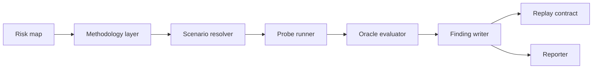

# Design

The design keeps methodology, execution, storage, and UI concerns separate.

::: tabs
== tab "Methodology"
Turns risks and invariants into scenario intent.

== tab "Execution"
Runs probes under profile constraints, sandboxing, and budget controls.

== tab "Evidence"
Writes findings, reports, replay scripts, and audit events.
:::

## Design pressure

The system favors explicit contracts over clever inference. That is why schema packages sit near the center of the architecture.
