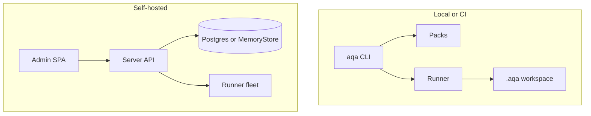

# Architecture Overview

`agentic-qa-kit` has two deployment modes: local/CI execution and self-hosted control plane execution.

::: callout info "Boundary" icon:layout-dashboard
The CLI owns local developer workflows. The server and admin packages own shared team workflows, tenancy, audit, and operational views.
:::

## Package families

- `packages/kit`: CLI and command implementations.
- `packages/runner`: scenario execution and replay.
- `packages/schemas`: shared contracts.
- `packages/server`: HTTP API and queue surface.
- `packages/admin`: React admin.
- `packs/*`: reusable risk, scenario, probe, and oracle content.
