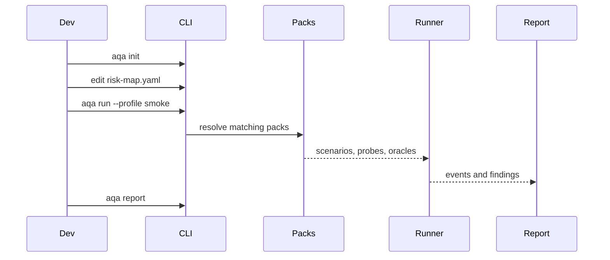

# Pipeline Workflow

::: steps
1. **Profile selects constraints**
   The profile sets allowed packs, budgets, destructive behavior, and verification requirements.
2. **Packs contribute scenarios**
   Matching packs bring reusable QA knowledge into the project.
3. **Runner executes probes**
   Probes touch the target system through HTTP, UI, LLM, migration, or custom commands.
4. **Reporter writes evidence**
   Reports convert findings into reviewable artifacts.
:::

## Workflow invariant

Every release-gate failure should be explainable from the original risk and reproducible from committed artifacts.
