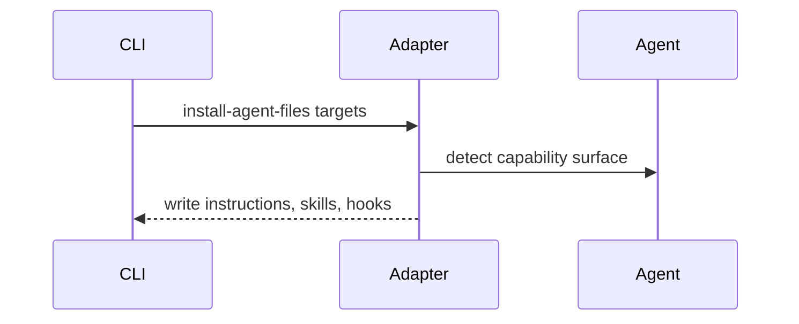

# Packs and Agents

Packs describe QA intent. Agents execute the work using the best primitives available in their environment.

::: grids
  ::: grid
    ::: card "Packs" icon:boxes
    Pack manifests bind risks, scenarios, probes, and oracles to a target system shape.
    :::
  :::
  ::: grid
    ::: card "Adapters" icon:plug
    Claude, Codex, Gemini, and Copilot adapters install the right instruction files and capabilities.
    :::
  :::
:::

## Capability negotiation

Agents do not all expose the same tools. The kit detects target capability and degrades from richer flows, such as subagents and hooks, to plain instruction files where needed.

