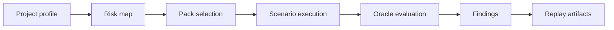

# Run Agentic QA

An agentic QA run combines project context, pack scenarios, a risk map, and an execution profile.

```bash
bunx aqa run --profile smoke
```

::: tabs
== tab "Smoke"
Fast, non-destructive checks for common regressions.

== tab "Exploratory"
Broader scenario search with higher budget and more generated probes.

== tab "Security"
Security-oriented packs, sandboxing, and stricter egress expectations.

== tab "Release gate"
CI-grade verification where high-priority findings must include reproducible replay artifacts.
:::

## Run flow



::: callout danger "Release gates need evidence" icon:shield-alert
A release-gate finding without deterministic reproduction evidence should be treated as incomplete, not as verified.
:::
