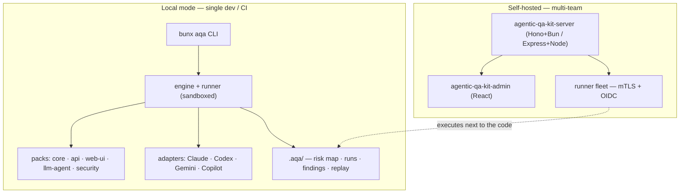

# agentic-qa-kit


> **agentic-qa-kit is not a test runner — it's an operating system for agentic QA.**
> A standardized framework that turns coding agents into senior QA engineers guided by **risk maps,
> invariants, scenarios, probes, oracles, findings and deterministic replay** — reproducible,
> versionable, and adaptable to every project. Bun-first, self-hosted, EU-ready.

::: callout info "New here? Read this page top to bottom" icon:compass
In five minutes you'll know exactly what this kit is, the problem it solves, why it beats every
"just run an LLM against my code" alternative, and where to click next. Every other page goes deeper —
this one gives you the whole picture.
:::

---

## What it is — in one minute

Coding agents — Claude Code, Codex CLI, Gemini CLI, GitHub Copilot CLI — are great at **writing**
code. They are poor QA engineers by default: they'll happily ship a feature without imagining how an
attacker might abuse it, how a second tenant could leak across, or how the tool-calling layer can be
tricked into refunding a payment without confirmation.

`agentic-qa-kit` gives the agent the **operating system** it needs to behave like a senior QA engineer
on **your** project, and pins it to evidence instead of vibes:

- **Declare what must never break** — an explicit `risk-map.yaml` with severity, likelihood,
  invariants, probes and oracles. Generic risks produce generic findings; your risks produce yours.
- **Run scenarios deterministically** — pre-built packs (API, web-UI, LLM-agent, security, migrations)
  executed through profiles (smoke, exploratory, security, release-gate) inside a sandbox.
- **Trust every finding** — three-level reproducibility with bug-level deterministic replay
  (`repro.sh`, `repro.curl`, `repro.playwright.ts`) and a hash-chained audit log you can verify.

> **In one line:** *the reusable framework that makes "ask an agent to QA my repo" operational,
> reproducible, governed and multi-agent — instead of a one-off prompt.*

---

## The problem it solves

Every team pointing an agent at their codebase hits the same wall: the agent improvises, the results
aren't reproducible, and nobody trusts the output. Here is the gap this kit closes.

| Without agentic-qa-kit | With agentic-qa-kit |
|---|---|
| You hand-write a giant QA prompt that rots, can't be versioned, and differs per engineer. | A reusable framework — `risk-map`, `profiles`, packs and oracles — committed to the repo and shared by the whole team. |
| The agent invents what "important" means and chases generic bugs. | An explicit **risk map** with invariants tells the agent precisely what must never break, with severity and likelihood. |
| "It found a bug" — but you can't reproduce it or hand it to a teammate. | Every finding ships a **deterministic replay** artifact (`repro.sh` / `repro.curl` / `repro.playwright.ts`). |
| Each tool (Claude, Codex, Gemini, Copilot) needs its own bespoke prompt and wiring. | One `aqa install-agent-files` writes first-class instructions + skills for **all four agents** with capability negotiation. |
| An agent loop quietly burns $400 overnight on tokens. | **Cost governance** — per-org/project/profile/scenario budgets in USD and tokens, with hard kill-switches. |
| A security probe runs straight against prod with no isolation. | **Container-per-scenario sandbox** by default for security/release-gate, with egress allowlists and resource limits. |
| You can't prove to an auditor what the agent did or whether logs were tampered with. | A **hash-chained audit log** + WORM export, verifiable in-browser, with SOC2/ISO control mappings. |

---

## Who it's for

::: grids
  ::: grid
    ::: card "Teams already coding with agents" icon:rocket
    Using Claude Code, Codex, Gemini or Copilot to write code? Point the same agent at your repo as a QA engineer — guided by your risk map, not its imagination.
    :::
  :::
  ::: grid
    ::: card "Security & platform engineering" icon:shield-check
    OWASP Top 10 Agentic (2026), STRIDE/FMEA risk discovery, sandboxed probes, egress allowlists and tool-call budgets — agentic red-teaming you can actually govern.
    :::
  :::
  ::: grid
    ::: card "Regulated & enterprise" icon:scale
    Hash-chained audit, WORM export, SOC2/ISO control catalog, BYOK + on-prem LLM (vLLM / Bedrock private / Azure OpenAI VNet / llama.cpp) and air-gap deploy.
    :::
  :::
  ::: grid
    ::: card "Multi-team self-hosters" icon:layers
    A control plane (server + React admin) and a runner fleet over mTLS + OIDC — scenarios execute next to the code, so the code never leaves your perimeter.
    :::
  :::
:::

---

## Why it's different — the moats

Most tools either **run** an LLM against your code or **lint** it. This kit makes agentic QA a
disciplined, reproducible, multi-agent operating model — and goes further than anything in the space.

::: grids
  ::: grid
    ::: card "Risk map is the heart" icon:target
    QA starts from an explicit `risk-map.yaml` — categories, severity, likelihood and machine-checkable **invariants**. The agent tests *your* must-never-break rules, not generic boilerplate.
    :::
  :::
  ::: grid
    ::: card "The 7-word mental model" icon:brain
    `Risk → Invariant → Scenario → Probe → Oracle → Finding → Replay`. Every concept is one of these seven things or a tool that operates on them — so the whole kit stays legible.
    :::
  :::
  ::: grid
    ::: card "Multi-agent native" icon:bot
    Claude · Codex · Gemini · Copilot as first-class adapters — not "Claude with the rest bolted on". Runtime capability negotiation picks each agent's best primitives (subagents, skills, slash commands, hooks).
    :::
  :::
  ::: grid
    ::: card "Deterministic replay where it matters" icon:repeat
    Three-level reproducibility (bug / scenario / agent). The kit never lies about LLM determinism — but bug-level deterministic replay is **required** for any release-gate verified finding.
    :::
  :::
  ::: grid
    ::: card "Sandbox by design" icon:box
    Container-per-scenario isolation by default for security and release-gate profiles, with egress allowlists, tool-call budgets, resource limits and cost kill-switches.
    :::
  :::
  ::: grid
    ::: card "Cost governance built-in" icon:wallet
    Per-org / project / profile / scenario budgets in USD and tokens, hard kill-switches and attribution to risk areas. No more "an agent loop burned $400 overnight".
    :::
  :::
  ::: grid
    ::: card "BYOK + on-prem LLM" icon:server
    Bring your own Anthropic/OpenAI keys, or run vLLM / Bedrock private / Azure OpenAI VNet / llama.cpp. Air-gap deployment supported end-to-end.
    :::
  :::
  ::: grid
    ::: card "Methodology rigor" icon:flask-conical
    OWASP Top 10 Agentic (2026) security pack, plus STRIDE / FMEA risk discovery, oracle ensembles and judge calibration — not ad-hoc prompting.
    :::
  :::
  ::: grid
    ::: card "Audit you can verify" icon:scroll-text
    A hash-chained audit log + WORM export, verifiable in-browser via Web Crypto, with SOC2 / ISO 27001 control mappings and an `aqa-audit-verify` CLI.
    :::
  :::
:::

---

## agentic-qa-kit vs. the alternatives

| Capability | **agentic-qa-kit** | A hand-written QA prompt | Classic test runners (Jest/Playwright) | SaaS AI test tools |
|---|:---:|:---:|:---:|:---:|
| Risk-map-driven, invariant-first QA | ✅ | ➖ | ❌ | ➖ |
| Multi-agent (Claude · Codex · Gemini · Copilot) | ✅ | ➖ | ❌ | ➖ |
| Deterministic bug-level replay artifacts | ✅ | ❌ | ✅ | ➖ |
| Sandbox-per-scenario + egress allowlists | ✅ | ❌ | ❌ | ➖ |
| Cost governance (USD/token budgets + kill-switch) | ✅ | ❌ | ❌ | ➖ |
| BYOK + on-prem / air-gapped LLM | ✅ | ➖ | ❌ | ❌ |
| Hash-chained, verifiable audit log | ✅ | ❌ | ❌ | ➖ |
| Self-hosted — your code never leaves | ✅ | ✅ | ✅ | ❌ |

> Legend: ✅ built-in · ➖ partial / extra cost / not exposed · ❌ not available.

---

## How it fits together

Local mode is a single `bunx aqa` CLI; the optional self-hosted control plane fans the same engine out
across a runner fleet — the code never leaves its perimeter.



The pipeline every run follows:

```text
Risk → Invariant → Scenario → Probe → Oracle → Finding → Replay
```

---

## Start in 30 seconds

::: steps
1. **Install Bun and add the kit**
   ```bash
   # macOS / Linux
   curl -fsSL https://bun.sh/install | bash
   cd /path/to/your/project
   bun add -d @padosoft/agentic-qa-kit
   ```
   GitHub Packages needs a one-time `.npmrc` with a `read:packages` token — see the Installation page.

2. **Scaffold and verify the workspace**
   ```bash
   bunx aqa init        # scaffold .aqa/{project,risk-map,profiles}.yaml + testing.md
   bunx aqa doctor      # green/yellow/red checklist of kit health
   bunx aqa validate    # schema-check every .aqa/* file
   ```

3. **Install agent files and run your first pass**
   ```bash
   bunx aqa install-agent-files --targets claude,codex,gemini,copilot
   bunx aqa run --profile smoke   # fast, non-destructive sweep
   bunx aqa report                # render report.md + report.json
   bunx aqa admin                 # SPA + API on http://127.0.0.1:5173
   ```
   Each finding lands with a deterministic replay artifact you can reproduce, hand to a teammate, or
   attach to a PR.
:::

**[→ Full Quickstart](/get-started/quickstart)** · **[→ Installation](/get-started/installation)** · **[→ Worked Example](/architettura/worked-example)**

---

## Batteries included for AI-assisted development

This repo ships **AI batteries** — a `CLAUDE.md` working guide, an `AGENTS.md` operating contract and
invocable `.claude/skills/` (`aqa-process-loop`, `aqa-self-resume`, `docmd-docs`) encoding the branch
strategy, validation gates and docs-sync discipline. Open the package in Claude Code, Cursor, Copilot
or Codex and your agent already knows the house rules.

---

## Where to go next

::: grids
  ::: grid
    ::: card "Quickstart" icon:zap
    Initialize a project and run your first smoke pass in minutes. **[Open →](/get-started/quickstart)**
    :::
  :::
  ::: grid
    ::: card "Concepts & Theory" icon:brain
    Why agentic QA is its own discipline, and the risk model behind every finding. **[Read →](/concetti-teoria/teoria)**
    :::
  :::
  ::: grid
    ::: card "Architecture" icon:boxes
    The sandboxed pipeline, data contract and the ADRs behind the design. **[Explore →](/architettura/overview)**
    :::
  :::
:::

::: callout tip "Package facts" icon:info
npm `@padosoft/agentic-qa-kit` (GitHub Packages) · Runtime Bun `≥ 1.3` / Node `22 LTS` ·
TypeScript strict · Apache-2.0 · Works with Claude · Codex · Gemini · Copilot ·
[GitHub](https://github.com/padosoft/agentic-qa-kit) · [Releases](https://github.com/padosoft/agentic-qa-kit/releases)
:::
