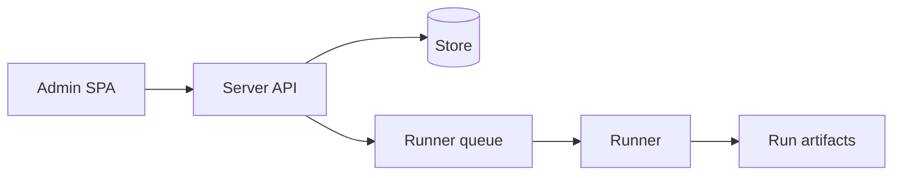

# Admin and Self-hosting

Self-hosted mode adds shared visibility for runs, findings, agents, profiles, cost, audit, and queues.

## Operational concerns

- Tenant and project scoping.
- OIDC and RBAC.
- Postgres or memory-backed store selection.
- Runner fleet capacity.
- Audit export and verification.
- Cost and token attribution.

::: callout warning "Local mode is still first-class" icon:laptop
Do not require a control plane for a single developer or CI-only workflow. Local mode should remain useful by itself.
:::
